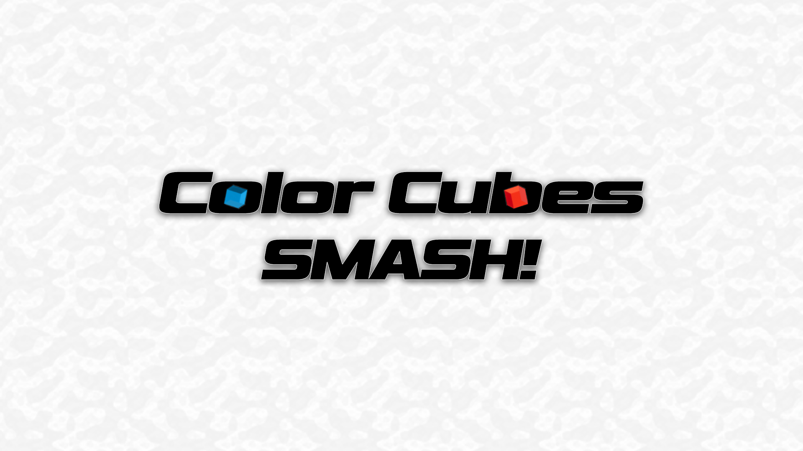

# Color Cubes Smash

Color Cubes Smash Gameplay: https://youtu.be/txA7d0jqw8g?si=R84R4qaz3W_HVNYc](https://youtu.be/rCVCQc6vdic?si=t7K05cXAtlX9GuTs

Color Cubes Smash is a Hyper-casual Unity game inspired by timeless classics like Fruit Ninja and Smash Hit.  
 
This project explores precision-based tap gameplay where players must smash the correct colored cubes as they are tossed into play. It combines the fast-paced engagement of Fruit Ninja with the clean, atmospheric style of Smash Hit.  
 
Key areas I focused on during development:  
🎮 Gameplay systems – randomization, fairness mechanics, and difficulty balancing.  
🖥 UI/UX design – Scalable Cross Platform UI (Android/PC), smooth transitions, polished visual presentation & Graphic design.  
📱 Platform optimization – consistent performance across PC & Android, with an optimized build size for mobile deployment. (32 MBs)  
 
🎵 A special thanks to Zen_Man for providing an amazing music track that elevates the atmosphere of the game! His contribution really brought the experience to life.  
Please Support Zen_Man on: https://lnkd.in/duKtsf6v  
